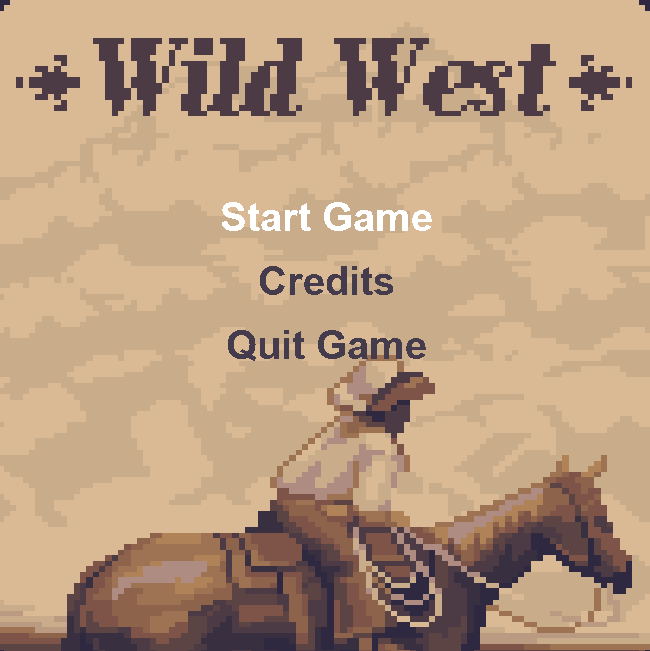
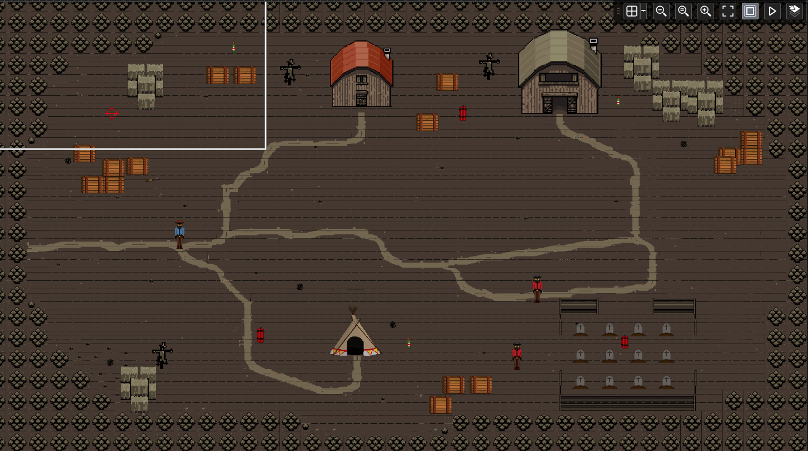
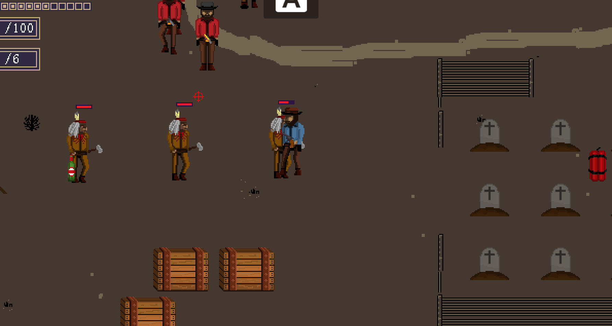
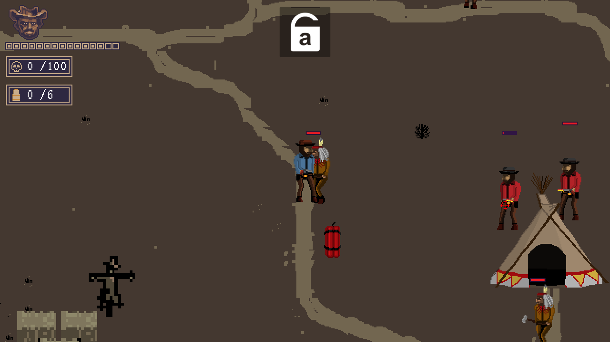
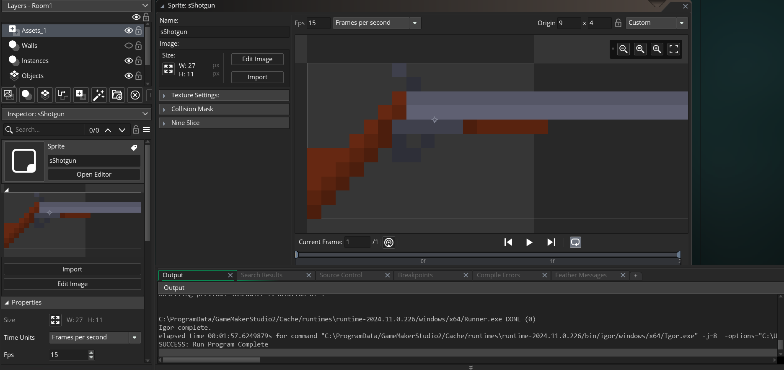
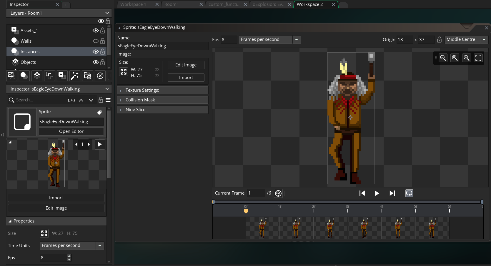

# Crvena Mrtva Osveta.exe installation file

## Overview
Crvena Mrtva Osveta is a Western-themed top-down shooter featuring retro pixel art visuals, dynamic gameplay mechanics, and AI-driven enemies developed in GameMaker Studio 2. This document provides clear, step-by-step instructions to install the game on your system 

## Screenshots
*   **Main menu:**
  

*   **Map:**
  

  *   **Gameplay:**
  

  

*   **Development:**
  

## System Requirements
- **Operating System:** Windows 7/8/10/11 or macOS (if applicable) 
- **Processor:** 1.6 GHz or higher
- **Memory:** 2 GB RAM 
- **Graphics:** Compatible with OpenGL 2.1 or DirectX 9 
- **Storage:** At least 50 MB of available space 

## Installation Steps
- **Download the Package:**  
  Navigate to the Download as Zip section of this repository and download the ZIP file.

- **Extract the Package:**  

- **Run the Installer:**  
  On Windows,after extracting the package double-click the `Crvena Mrtva Osveta.exe` file.

- **Follow the Installation Wizard:**  
  Accept the license agreement, choose your installation directory (or use the default,if you want you can create Desktop Shortcut and click "Install" to begin the installation process 

- **Complete Installation:**  
  Once the installation finishes, click "Finish" on the wizard screen.

- **Launch the Game:**  
  Double-click the file `Created with GameMaker` from your desktop or start menu to start playing Crvena Mrtva Osveta

## Credits
Developed by David Jezidžić, Filip Čalić, and Ivan Lovrić as part of a seminar project in at Sveučilište u Splitu, Fakultet elektrotehnike, strojarstva i brodogradnje [1].

This README provides detailed installation instructions that guide you from downloading and extracting the package to launching the game. Enjoy installing and playing Crvena Mrtva Osveta!

